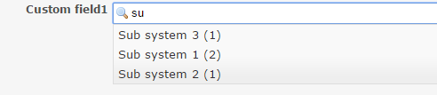

# Redmine Custom Auto-Complete

This plugin adds auto-complete to the custom fields.

- This plugin only works in text format fields.

## Installation

1. Clone or copy files into the Redmine plugins directory
   `git clone https://github.com/taikii/redmine_custom_auto_complete.git`
2. Restart Redmine
3. Setup the permission for the role
4. Enable module for your project

## License

This plugin is released under the MIT License.
